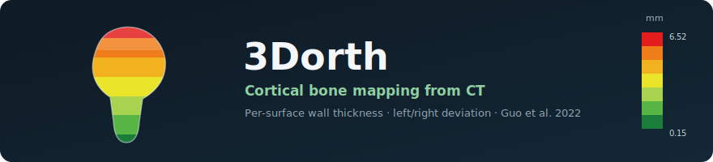
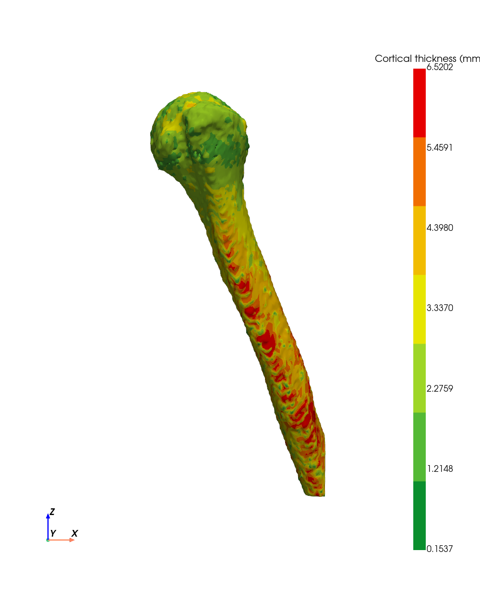
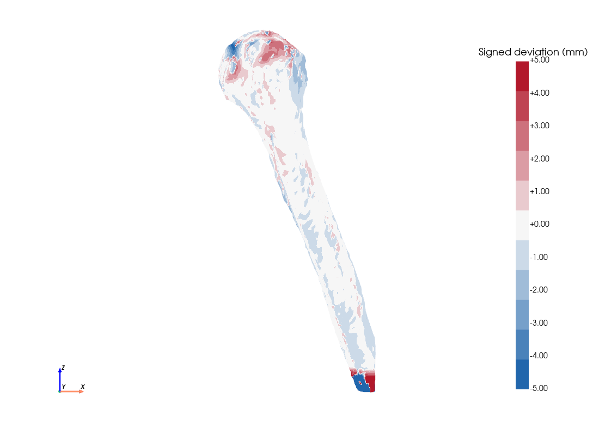
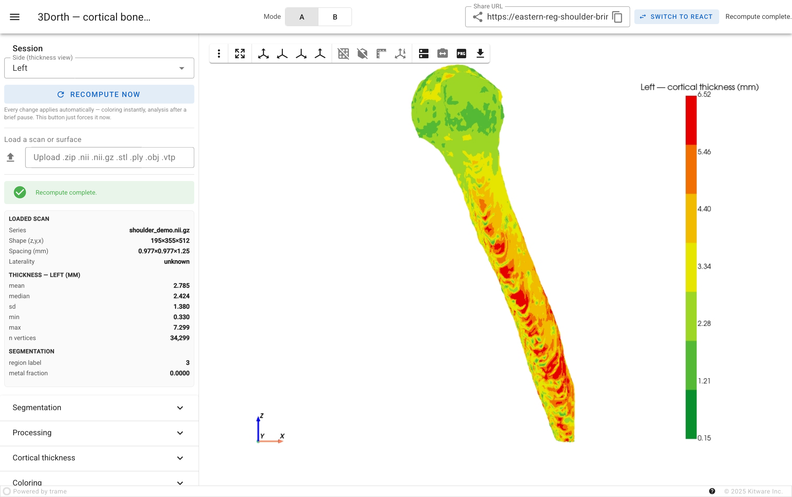
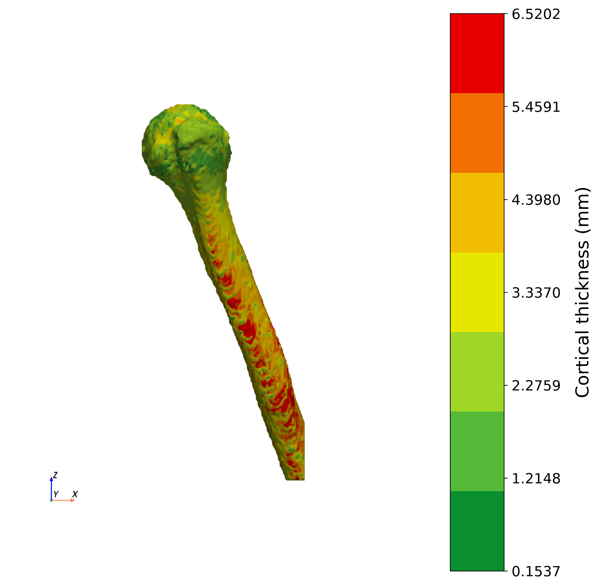

<p align="center">
  
</p>

# 3Dorth — cortical bone mapping from CT

3Dorth reads a CT scan of a bone, measures how thick the cortex (the hard outer
wall) is across the whole surface, and paints that thickness onto a 3D model you
can rotate. It can also line up two bones — an operated shoulder against the
healthy other side, say — and show where bone has been added or lost, in
millimetres.

It reproduces the cortical-thickness method from **Guo et al. 2022** (proximal
humerus) and generalises it: it loads whatever bone is in the scan and puts the
anatomy-specific choices on sliders instead of hard-coding them.

The question behind it is clinical — does suture-anchor repair change the bone of
the proximal humerus over the years? — but nothing in the tool is humerus-only.

> Research tool, not a diagnostic. Every output is de-identified.

## What you get


<sub>The React frontend on the bundled de-identified demo. The trame frontend
exposes the identical feature set.</sub>

| Mode A — cortical thickness | Mode B — left/right deviation |
|---|---|
|  |  |
| One scan. Green = thin wall, red = thick, in mm. | Two sides registered; red = bone gained, blue = lost. |

- **Mode A** segments the bone from its CT density, computes wall thickness at
  every surface point, and colours it with the paper's green→red scale.
- **Mode B** rebuilds both bones, aligns them (with an optional left/right
  mirror), and reports a signed surface deviation with per-region statistics.

Everything is interactive and applies in real time:

- **Load** a DICOM `.zip`, NIfTI, or a surface mesh — or use the bundled
  de-identified demo. A bilateral scan splits into Left/Right; pick a **region**
  by its thumbnail.
- **Every parameter applies automatically** — colour/range/steps re-colour
  instantly, segmentation/thickness parameters re-run after a short pause (no
  Apply click needed).
- **Hover** the surface for the per-point value; **export** PNG/TIFF (with a DPI),
  STL/PLY/OBJ/VTP, or DICOM with a camera pose; **Mode B** adds a manual-anchor
  nudge and a reference/target swap.
- **Share** a public link (a resilient Cloudflare tunnel that survives sleep/wake)
  and **switch between the two UIs** from either one.

## Get it running

Docker and the Compose plugin are all you need on the server:

```bash
git clone https://github.com/ArioMoniri/3Dorth.git && cd 3Dorth && ./deploy.sh
```

That builds everything and starts the API plus both frontends:

| Service | URL |
|---|---|
| React UI | `http://<server>:8088` |
| trame UI | `http://<server>:8081` |
| API + docs | `http://<server>:8000/docs` |

No patient data is in the image — upload a CT `.zip` in the UI to start.
`./run.sh react` or `./run.sh trame` bring up just one frontend; `./run.sh down`
stops everything.

**Share it temporarily.** With the servers running, `./scripts/share.sh` opens
public Cloudflare tunnels to both UIs and writes the URLs so the in-app Share
panel picks them up. It stays running and **keeps the tunnels alive across
laptop sleep/wake and network drops** — on a wake it restarts them and rewrites
the URL, and the Share panel polls `/api/config`, so the link updates live with
no manual step. The URLs are ephemeral and unauthenticated — fine for a quick
look, not for anything sensitive (use a named Cloudflare tunnel + Access for that).

<details>
<summary><b>Performance, memory, and GPU</b></summary>

The compute (segmentation, local thickness, registration) is bounded so it does
not exhaust RAM on a small machine, and uses the GPU where present:

- Volumes are held as int16 HU; oversized uploads are block-downsampled to a
  voxel budget; the local-thickness grid resolution adapts to volume size.
- Heavy computes are serialised (one at a time by default), and only the most
  recent few scans are kept in memory.
- Rendering uses the GPU (vtk.js in the browser, VTK server-side); if CuPy + a
  CUDA device are present, distance transforms run on the GPU, otherwise on the
  CPU. Everything degrades gracefully.

All limits are environment variables so a device can be sized:
`THREEDORTH_MAX_SESSIONS`, `THREEDORTH_COMPUTE_CONCURRENCY`,
`THREEDORTH_MAX_WORK_VOXELS`, `THREEDORTH_MAX_ISO_VOXELS`, `THREEDORTH_GPU`.

</details>

## Which frontend?

Both run the same analysis; they differ in where the 3D drawing happens.

- **trame** renders on the server with VTK and calls the Python core directly.
  Nothing to build, quickest to stand up — use it to look at your own data.
- **React** renders in the browser and talks to the API. More setup, but scales
  to many users and is easier to embed — use it when deploying for a group.

Both build their control panels from the same parameter list, so they always
expose the same knobs (a test fails the build if they ever drift apart).

<p align="center">
  
</p>
<p align="center"><sub>The trame frontend on the demo — same features as React, rendered server-side. The Share URL (top) is a live Cloudflare link.</sub></p>

<details>
<summary><b>Using it, step by step</b></summary>

1. **Load** a CT `.zip` (the sample archives wrap a Weasis viewer around a
   `dicom/` folder — the ingest recurses past it), or use the bundled demo scan
   locally. The ingest reports geometry, laterality, and hardware, and splits a
   bilateral scan into left/right.
2. **Mode A** — pick a side, adjust parameters if you want (they default to the
   paper's values), and Apply. The server re-segments and recomputes the map.
   Region toggles hide non-bone (table, ribs); line/height tools reproduce the
   paper's measurements.
3. **Mode B** — choose a reference side and a target side, turn on the sagittal
   mirror for a left/right comparison, and compute. The panel reports the
   registration error, the deviation statistics, and the percent of surface past
   1 mm and 2 mm, split into gain and loss.

</details>

<details>
<summary><b>Full parameter list (28 knobs) and reproducibility</b></summary>

Everything configurable lives in one registry,
[`core/parameters.py`](core/parameters.py) — all 28 parameters with ranges and
units. Both UIs read that registry, and the active values are written to
[`config.yaml`](config.yaml), so re-running from a saved `config.yaml`
reproduces the numbers. The defaults reproduce Guo et al. 2022:

| Parameter | Default | From the paper |
|---|---|---|
| HU threshold | 226–1600 | bone lower/upper bound |
| Cortical thickness clamp | 0.33–10 mm | min/max wall thickness |
| Thickness method | local thickness (Hildebrand–Rüegsegger) | = 3-Matic wall thickness |
| Colorbar | green→red, 7 steps, 0.1537–6.5202 mm | Fig. 2 legend |
| Sampling line | 3 points below the lesser tuberosity | Fig. 2A |

</details>

<details>
<summary><b>Method and how it was checked</b></summary>

Segmentation and thickness follow **Guo et al. 2022, _Eur J Med Res_ 27:102**
(3D cortical bone mapping of the proximal-humerus surgical neck). The full
mapping of each default to the paper is in [`docs/METHOD.md`](docs/METHOD.md).

Thickness is the largest-inscribed-sphere ("local") thickness of the cortical
mask. A second method — two-surface ray casting — is kept as a cross-check: the
two agree on a hollow-shell phantom, and on the real humerus the local-thickness
whole-surface mean (~2.8 mm) sits inside the paper's Table-1 range (2.1–2.85 mm).
They diverge in dense subcortical trabecular bone, which is expected — that is
why density-deconvolution methods (Treece/Poole) are noted as future work rather
than used as the main measure.

For Mode B, positive means the target surface sits **outside** the reference
(bone gain); the sign is verified on concentric-sphere phantoms before any real
result is reported.

The paper's publication figure — the discrete colorbar and thickness map — is
reproduced below.



</details>

<details>
<summary><b>Run locally (development)</b></summary>

```bash
uv venv --python 3.12 .venv
uv pip install -r requirements.txt
make test                    # 80+ tests
python scripts/watchdog.py   # independent verification, should be GREEN

# then, in three terminals:
.venv/bin/python -m uvicorn api.main:app --port 8000        # API
cd app_react && npm install && npm run dev                  # React on :5173
.venv/bin/python -m app_trame.app --server --port 8081 --timeout 0   # trame
```

Python 3.12 is required — the imaging stack (SimpleITK, VTK, open3d) has no
wheels for 3.13/3.14 yet.

Behind a reverse proxy in production, keep the WebSocket upgrade headers and long
read timeouts already set in [`deploy/nginx.conf`](deploy/nginx.conf) and allow
~300 MB uploads. 8 GB RAM is comfortable; volumes and meshes stay in memory
during compute.

</details>

<details>
<summary><b>Limitations (read before trusting a result)</b></summary>

- **One subject describes; it does not prove.** A left/right difference in a
  single person mixes surgical change with normal dominant-arm asymmetry.
- **A fused bone needs manual isolation.** If the bone touches its neighbours in
  the scan (an adducted humerus against the ribcage), auto-isolation can grab the
  wrong structure — select or clip the region by hand before Mode B.
- **CT cannot see radiolucent anchors.** Bioabsorbable/PEEK suture anchors don't
  show up, so the operated side can't always be told from the scan alone.
- **Metal artifact.** Dense hardware is masked and reported, but streak artifact
  can still nudge nearby thresholding.
- Research use only — not a clinical diagnostic.

</details>

## Roadmap

Reviewed and designed (`docs/IMAGING_DESIGN_clinical.md`,
`docs/IMAGING_DESIGN_technical.md`), implementation in progress:

- An in-panel **image viewer** — axial/coronal/sagittal slices beside the 3D map,
  with a crosshair linking a point on the surface to the slices. Slices are
  rendered on demand by the API, so the whole volume never goes to the browser.
- **Compare** two series' matched cross-sections side by side, gated on
  registration quality so it never implies a correspondence the fit can't support.
- **AR** — export a GLB to view the bone on a phone (native AR), with a WebXR
  cross-section prototype where the device supports it.

Per the review: measurement stays on the source geometry (never on a reformatted
slice), orientation and laterality are derived from the data or shown as
unverified (never guessed), and AR is for education/consent, not measurement.

## Contributing, changelog, license

[`CONTRIBUTING.md`](CONTRIBUTING.md) covers the frontend-parity rule and the
workflow; [`CHANGELOG.md`](CHANGELOG.md) has the release history; bug reports and
feature requests use the templates in `.github/ISSUE_TEMPLATE/`.

Apache License 2.0 — © 2026 Ariorad Moniri. See [`LICENSE`](LICENSE) and
[`NOTICE`](NOTICE).
